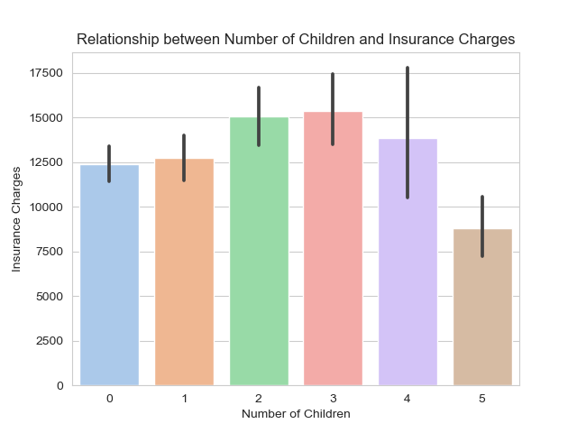
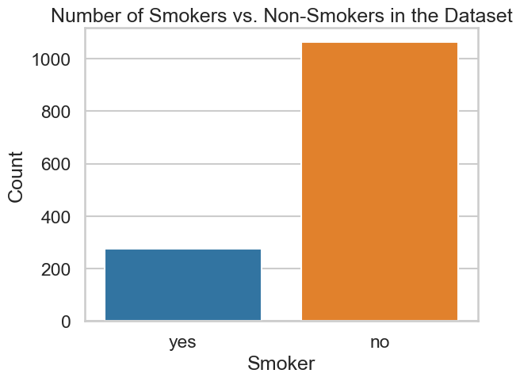
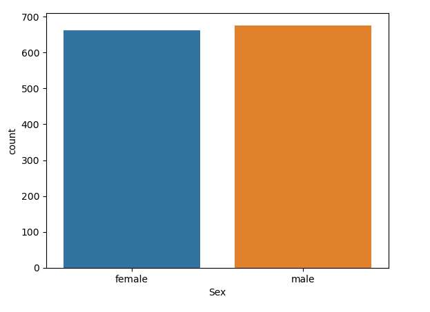
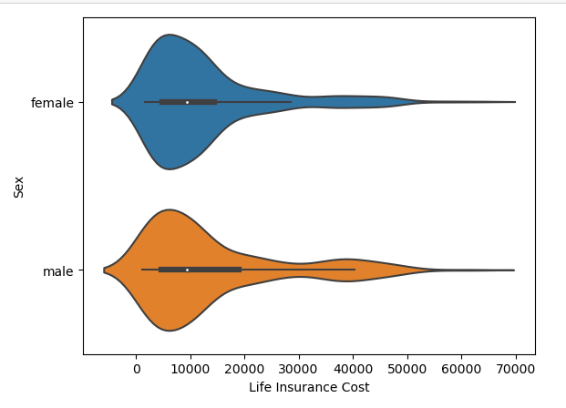
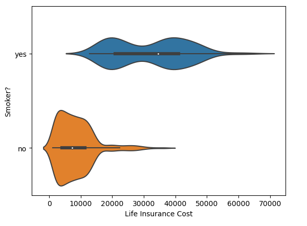
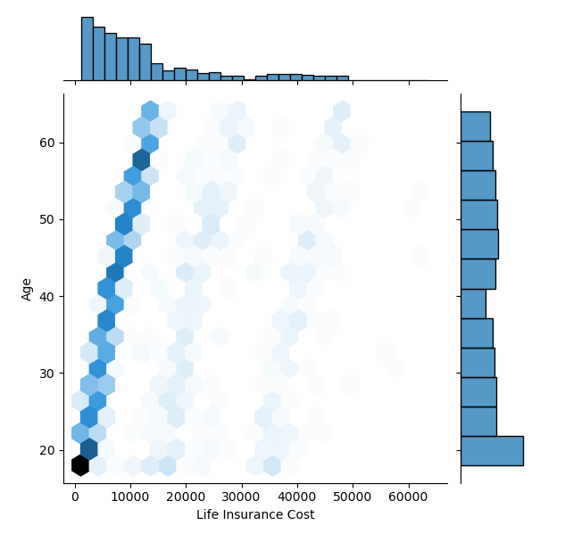
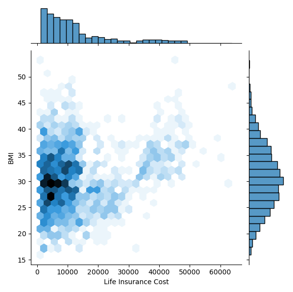
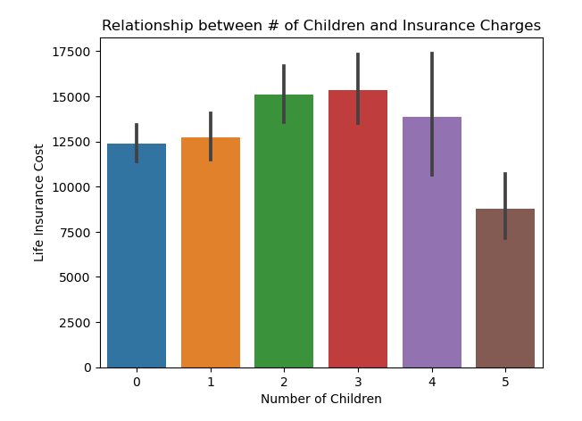
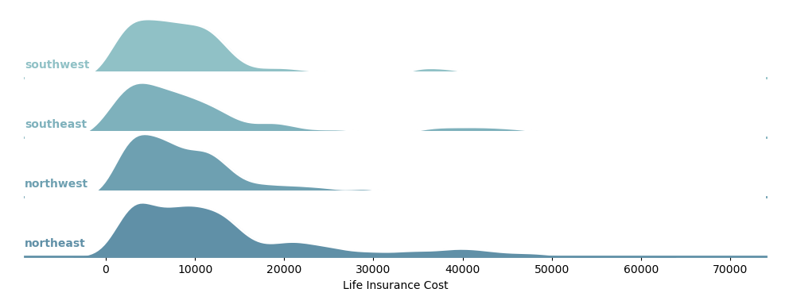

# Group 25 - Insurance Charge Factors

## Introduction

Welcome to our project on analyzing the factors affecting insurance pricing. The insurance industry is a vital component of the global economy, providing financial protection and risk management solutions to individuals and businesses alike. Understanding the factors that affect insurance pricing is important for insurers to make informed pricing decisions, for consumers to make informed purchase decisions, and for policymakers to regulate the industry effectively. By analyzing a  insurance pricing dataset, we targeted the impact of changes in law, technology, and consumer preferences on insurance pricing, ultimately contributing to a more transparent and efficient insurance market through our research and visualizations.

Our team was interested in analyzing this dataset as we were curious what variables influence higher charges, and to what affect. We chose this dataset as it was clean, straightforward, relevant, and interesting to analyze. This topic is relevant to us and to many others as we will likely purchase life insurance policies throughout our adult lives. 

---

## Exploratory Data Analysis

One of the first questions we had about the dataset is what variables play roles in determining insurance charges, and to what extent. Before forming our research questions, we created a few visualizations to help us gain a better understanding of our dataset. 

This visualization sparked some curiosity in us. What mediating factors exist in the relationship between number of children and insurance charges? Is number of children a determining factor in higher charges, and to what extent? How do age, gender, sex, and smoker status support or disprove the idea that individuals with 3 children have the highest insurance charges?

This visualization served as the basis for research question & analysis 3 (Nadia).

The scatter plot shows the relationship between age and smoker status, with age plotted on the x-axis and smoker status on the y-axis. The hue parameter is used to differentiate the data points based on smoker status. The marker parameter is set to 's', which represents a square marker shape. The legend parameter is set to 'full', which shows a legend for each level of the hue variable.

The line plot shows the mean smoker status for each age group, with age plotted on the x-axis and mean smoker status on the y-axis. The err_style parameter is set to None, which removes the error bars from the plot. The estimator parameter is set to np.mean, which calculates the mean smoker status for each age group.

Overall, this code generates a visualization that displays the relationship between age and smoker status, with a scatter plot and a line plot. The scatter plot shows the individual data points, while the line plot shows the trend of mean smoker status for each age group. (Prabh)

---

## Question 1 & Analysis (Prabh)

### **How have changes in law, technology, and consumer preferences affected the pricing of insurance policies over the past decade?**

1. As we delved into the relationship between smoking status and insurance costs, we found that smokers generally have higher costs compared to non-smokers. We decided to create box plots to visualize the distribution of insurance costs for smokers and non-smokers. Our analysis revealed a clear distinction between the two groups, with smokers having significantly higher costs. This insight can be valuable to insurance companies when determining policy premiums for smokers, as they pose a higher financial risk.

The box plot above shows a clear distinction in insurance costs between smokers and non-smokers, and the t-test confirms that the difference is statistically significant. Insurance providers should take smoking status into account when determining policy premiums, as smokers pose a higher financial risk.

2. When exploring the impact of age on insurance costs, we observed a trend that suggests older individuals generally incur higher costs. We created a line chart to visualize this relationship more effectively. The chart demonstrated a positive correlation between age and insurance costs, signifying that as individuals grow older, their costs tend to increase. This finding can be used by insurance providers to offer age-based pricing strategies, ensuring a fair distribution of costs among policyholders.

The scatter plot above demonstrates a positive correlation between age and insurance costs, indicating that older individuals typically incur higher costs. Insurance providers can offer age-based pricing strategies to ensure a fair distribution of costs among policyholders.

3. In our exploration of the influence of region and number of children on insurance costs, we discovered variations in insurance costs across regions and different family sizes. We created a heatmap to visualize these relationships, which revealed that the southeast region generally has higher costs, especially for those with more children. This information could be useful for insurance companies in developing region-specific policies and targeting their marketing efforts more effectively.

The grouped bar chart reveals variations in insurance costs across regions and among families with different numbers of children. The multiple regression analysis shows that region and number of children are significant predictors of insurance costs. Insurance providers can use this information to develop region-specific policies and target their marketing efforts more effectively.

In my analysis of the various factors affecting insurance charges. I first started off our analysis by looking at the impact of smoking status on insurance costs. I found a significant difference in expenses between smokers and non-smokers, with smokers facing higher costs. This outcome implies that insurance providers should take smoking status into account when setting policy premiums.

Following that, I explored the connection between age and insurance costs. Our scatter plot displayed a positive correlation, signifying that older individuals generally incur higher costs. This understanding can assist insurance companies in developing age-based pricing strategies to ensure a fair allocation of costs among policyholders.

Finally, I examined the influence of region and the number of children on insurance costs. Our dataset revealed variations in costs across different regions and for families with varying numbers of children. Multiple regression analysis validated the importance of these factors in forecasting higher insurance costs. This data can help insurance providers in creating region-specific policies and effectively targeting their marketing efforts.

---

## Question 2 & Analysis (Som)

### **Which lifestyle choices/characteristics are responsible for high insurance costs and in what order? Which groups (e.g. related to geographical or age) are likely to be charged the highest? Are these decisions on cost influenced by any harmful gender stereotypes?**

                                                    Count of Males & Females

**Observation:**

When reviewing this chart, we can deduce that there is no substantial difference between the amount of men and woman that were assesed for the dataset. Based on this observation we can assure that our conclusions will not be biased towards one sex or another because the data was equally inclusive towards both groups.

                                                    Insurance Cost in Relation to Sex

**Observation:**

Here we can deduce that men and women's insurance cost distribution is quite similar, which eliminates any concerns in regards to bias from insurance companies; no one gender is liklier to pursue a harmful lifestyle over the other. No harmful stereotypes were at play when it came to sex.

                                                    Insurance Cost in Relation to Smoker Status

**Observation:**

Here we can see that an individual's smoker status plays a pivotal role when it comes to dictating insurance costs with smokers averaging around 15000 to 35000 dollars more than non-smokers. The graphs gives us a stark difference between each group's insurance premiums, proving the decision to more detremental than one would intially anticipate.

                                                    Insurance Cost in Relation to Age

**Observation:**

The following graph suggests that insurance prices tend to grow consistently as an indiviual ages. This can be in part due to higher likelihood of health complications. Here, the insurance statistics proved to follow a quite logical/intuitive pattern. A strange observation would be that there seems to be a higher concentration of applicants that are around the age of 20, this could be attributed to the impact of age on affordability.

                                                    Insurance Cost in Relation to BMI

**Observation:**

From the graph above we can tell that high BMI is much likelier to increase insurance prices than low BMI. And accordng to the data, the unhealthiest BMI seemed to range from 30-45 and the most common seemed to be around the range of 25-30. This again alligns well with our preconceived understanding of linearity between BMI and likelyhood of heart failure and other complications.

                                                    Life Insurance Cost

**Observation:**

Oddly enough, the trend in the graph ressembles a curve and we notice that people who have more than 3 kids average lower insurance costs. We would normally assume that having more children tends to burden people's financial circumstances as well as add liabilities and stress, yet we made such a surprising observation; what could cause insurance costs to go down for people who have more than 3 children?

                                                    Distribution of Insurance Cost in Relation to Region

**Observation:**

The northeast region appears to be the one that yields the highest incurance costs on average. We can suspect that this has to do with environmental circumstances, potentially meaning that the region is likelier to be struck by natrual disasters or doesn't support an adequate healthcare infastructure amongst other resources.

**Overview:**

From our analysis we discovered some fascinating details about the influence of each lifestyle attribute. That is not to say that the answers to some of our questions did not deviate from any preconcieved notions about positive/safe choices. 

- No harmful gender streotypes were at play and we deduced that the data consisted of near equal amounts of both sex. There was not a substantial difference in either group's cost. Men did lean slightly more towards higher insurance costs, but the difference is explained by the identically higher count of men in the dataset; still negligible in the end.

- Smoker status played an incredibly crucial role, more so than expected and more so than any other category we investigated. The average difference between each group was twenty thousand dollars. There was also a stark difference between each violin chart's distribution and location on the cost axis.

- Age played a lesser role than one would imagine, with a good chunk of the older population paying just around eight thousand dollars more than the younger population.

- High BMI played a far greater role than low BMI when it came to yielding a higher insurance premium while the majority of the population seemed to be on the higher side.

- The graph comparing number of children to insurance costs presented an anomoly by suggesting that insurance costs go down if you have more than three children. This raised a question as to what factors may cause this decision.

- Where individuals lived was the least influential factor. A bigger chunk of the northeast and southeast residents paid higher prices but the difference was not notable.

**Takeaway:**

In the end, Smoker status proved to impact insurance costs the most on average, followed by Age, BMI, number of children, and lastly region. We were able to deduce this by comparing the outliers with higher costs and their lower averages within each category; the difference in cost gave us an estimate.

---

## Question 3 & Analysis (Nadia)

### **How does the number of children an individual has influence their insurance charges?**

I was interested in examining the relationship between number of children and insurance charges, and whether there was a direct correlation between the two. I was curious whether number of children was a determining variable indicative of higher insurance charges, or whether it was a descriptive variable added to the dataset for more background information. 

To answer my research question, I analyzed the relationship alone, and considering the other variables of sex, BMI, smoker status, and age.

As we saw in the EDA, the basic relationship between number of children and insurance charges shows that charges gradually increase from 1 to 3 children, before dropping at 4 children and drastically dropping at 5 children. This is likely skewed due to the fact that less people in the dataset have 4 and 5 children in comparison to 1, 2, and 3 children. If the data was not skewed, we may see a positive linear relationship between insurance charges and number of children. 

However, it's important to consider the other variables at play.

**1. Considering Sex**: Do men or women have higher insurance charges when considering the number of children?

Analyzing the relationship initially reveals that men generally have higher insurance charges, regardless of the number of children they have. The exception to this statement exists for 4 and 5 children, likely due to the skew in the dataset.

However, through analysis with Som's research question and visualizations, we find that this is due to a higher count of men in the dataset, and that it is not a reliable relationship due to the skew. We can consider sex to be a negligible variable in determining insurance charges, even when considering children. 

**2. Considering BMI Category**: What BMI category has the highest insurance charges when considering number of children?

Analyzing the relationship reveals that obese individuals have the highest insurance charges, regardless of the number of children they have. Highest insurance charges are then followed by those who are overweight, and then those who are healthy weight. This suggests that the higher an individual's BMI is, the higher their insurance charges will be. 

The data for underweight individuals is skewed, likely due to very few individuals in the dataset being underweight. 

**3. Considering Smoker Status**: Do smokers or non-smokers have higher insurance charges when considering number of children?

Analyzing the relationship shows that overall, smokers have much higher charges than non-smokers. This relationship occurs regardless of the number of children the individual has. This appears to be the strongest relationship, suggesting smoker status is the most indicative variable in higher charges. 

 The only exception to this statement is for the 5 children column, where the data may be skewed due to very few or no smokers with 5 children present in the dataset.

**4. Considering Age**

What age category has the highest insurance charges, considering children?

Analyzing these plots reveals that regardless of number of children, insurance charges increase exponentially with age. This is the most clear linear relationship in my analysis. Alongside being a smoker, older age is probably the most indicative variable of higher insurance charges. 

### Conclusion 

 I was very interested in how (or if) number of children plays a role in determining insurance charges. I did this by analyzing the relationship alone, and then by considering other variables present in the dataset. In conclusion, I found that number of children alone does not play a large role in how an individual's insurance charges are determined. The variable of number of children was likely added to the dataset to supplement the available information and provide background into the profiles of insurance policy purchasers. 

**The answer to my research question:** Number of children does not seem to influence insurance charges in any detectable or significant way. 

Variables more closely related to higher insurance charges than number of children or sex include:

1. **Smoker Status:** The relationship between smokers and higher insurance charges is undeniable. On average, smokers will pay much more for insurance policies than non-smokers. 
2. **Age:** Age appears to have the strongest linear relationship with an increase in insurance charges. 
3. **BMI:** There appears to be a linear relationship between BMI and insurance charges. On average, those who are obese and overweight will pay much more for insurance policies than those at a healthy weight.

Overall, this analysis can assist individuals in identifying personal factors that increase insurance charges. 

---
## Summary & Conclusions

This project helped us to successfully identify variables that are related to higher insurance charges, and variables that are not determining factors. Through our analyses, we found that being a smoker increased costs more than any other variable alone. After considering smoker status, age and BMI were also determining factors. We also found that sex and number of children are negligible factors in determining insurance charges.

In conclusion, changes in law, technology, and consumer preferences have had a significant impact on the pricing of insurance policies over the past decade. Through our analysis of smoking status, age, region, and number of children, we have demonstrated that these factors play a vital role in determining insurance costs. Insurance companies should take these factors into account when setting policy premiums and developing pricing strategies. By doing so, they can ensure a fair allocation of costs among policyholders and effectively target their marketing efforts. Ultimately, the goal is to provide affordable insurance options that meet the needs of consumers while also ensuring that insurance companies remain financially stable.
