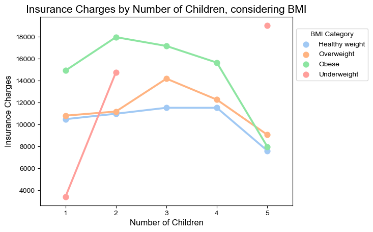
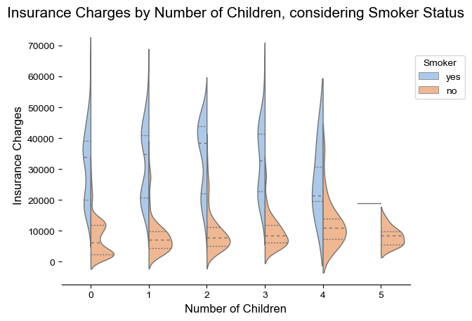

# Group 25 -

## Introduction

Welcome to our project on analyzing the factors affecting insurance pricing. The insurance industry is a vital component of the global economy, providing financial protection and risk management solutions to individuals and businesses alike. Understanding the factors that affect insurance pricing is important for insurers to make informed pricing decisions, for consumers to make informed purchase decisions, and for policymakers to regulate the industry effectively. By analyzing a  insurance pricing dataset, we targeted the impact of changes in law, technology, and consumer preferences on insurance pricing, ultimately contributing to a more transparent and efficient insurance market through our research and visualizations.

Our team was interested in analyzing this dataset as we were curious what variables influence higher charges, and to what affect. We chose this dataset as it was clean, straightforward, relevant, and interesting to analyze. This topic is relevant to us and to many others as we will likely purchase life insurance policies throughout our adult lives. 

---

## Exploratory Data Analysis

---

## Question 1 & Analysis (Prabh)

### **How have changes in law, technology, and consumer preferences affected the pricing of insurance policies over the past decade?**

1. As we delved into the relationship between smoking status and insurance costs, we found that smokers generally have higher costs compared to non-smokers. We decided to create box plots to visualize the distribution of insurance costs for smokers and non-smokers. Our analysis revealed a clear distinction between the two groups, with smokers having significantly higher costs. This insight can be valuable to insurance companies when determining policy premiums for smokers, as they pose a higher financial risk.

The box plot above shows a clear distinction in insurance costs between smokers and non-smokers, and the t-test confirms that the difference is statistically significant. Insurance providers should take smoking status into account when determining policy premiums, as smokers pose a higher financial risk.

2. When exploring the impact of age on insurance costs, we observed a trend that suggests older individuals generally incur higher costs. We created a line chart to visualize this relationship more effectively. The chart demonstrated a positive correlation between age and insurance costs, signifying that as individuals grow older, their costs tend to increase. This finding can be used by insurance providers to offer age-based pricing strategies, ensuring a fair distribution of costs among policyholders.

The scatter plot above demonstrates a positive correlation between age and insurance costs, indicating that older individuals typically incur higher costs. Insurance providers can offer age-based pricing strategies to ensure a fair distribution of costs among policyholders.

3. In our exploration of the influence of region and number of children on insurance costs, we discovered variations in insurance costs across regions and different family sizes. We created a heatmap to visualize these relationships, which revealed that the southeast region generally has higher costs, especially for those with more children. This information could be useful for insurance companies in developing region-specific policies and targeting their marketing efforts more effectively.

The grouped bar chart reveals variations in insurance costs across regions and among families with different numbers of children. The multiple regression analysis shows that region and number of children are significant predictors of insurance costs. Insurance providers can use this information to develop region-specific policies and target their marketing efforts more effectively.

In my analysis of the various factors affecting insurance charges. I first started off our analysis by looking at the impact of smoking status on insurance costs. I found a significant difference in expenses between smokers and non-smokers, with smokers facing higher costs. This outcome implies that insurance providers should take smoking status into account when setting policy premiums.

Following that, I explored the connection between age and insurance costs. Our scatter plot displayed a positive correlation, signifying that older individuals generally incur higher costs. This understanding can assist insurance companies in developing age-based pricing strategies to ensure a fair allocation of costs among policyholders.

Finally, I examined the influence of region and the number of children on insurance costs. Our dataset revealed variations in costs across different regions and for families with varying numbers of children. Multiple regression analysis validated the importance of these factors in forecasting higher insurance costs. This data can help insurance providers in creating region-specific policies and effectively targeting their marketing efforts.

---

## Question 2 & Analysis (Som)

### **Research Question here**

---

## Question 3 & Analysis (Nadia)

### **How does the number of children an individual has influence their insurance charges?**

I was interested in examining the relationship between number of children and insurance charges, and whether there was a direct correlation between the two. I was curious whether number of children was a determining variable indicative of higher insurance charges, or whether it was a descriptive variable added to the dataset for more background information. To answer my research question, I analyzed the relationship alone, and considering the other variables of sex, BMI, smoker status, and age.

**1. Basic Relationship**

Analyzing the basic relationship between number of children and insurance charges shows that charges gradually increase from 1 to 3 children, before dropping at 4 children and drastically dropping at 5 children. This is likely skewed due to the fact that less people in the dataset have 4 and 5 children in comparison to 1, 2, and 3 children. If the data was not skewed, we may see a positive linear relationship between insurance charges and number of children. However, it's important to consider the other variables at play.

**2. Considering Sex**

Do men or women have higher insurance charges when considering the number of children?

Analyzing the relationship reveals that men generally have higher insurance charges, regardless of the number of children. The exception to this statement exists for 4 and 5 children, likely due to the skew in the dataset.

**3. Considering BMI Category**

What BMI category has the highest insurance charges when considering number of children?

Analyzing the relationship reveals that obese individuals have the highest insurance charges, regardless of the number of children they have. Highest insurance charges are then followed by those who are overweight, and then those who are healthy weight. The data for underweight individuals is skewed, likely due to very few individuals in the dataset being underweight. 

**4. Considering Smoker Status**

Do smokers or non-smokers have higher insurance charges when considering number of children?

Analyzing the relationship shows that overall, smokers have much higher charges than non-smokers. This relationship occurs regardless of the number of children the individual has. The only exception to this statement is for the 5 children column, where the data may be skewed due to very few or no smokers with 5 children present in the dataset.

**5. Considering Age**

What age category has the highest insurance charges, considering children?

Analyzing these plots reveals that regardless of number of children, insurance charges increase exponentially with age. This is the most clear linear relationship in my analysis. Alongside being a smoker, older age is probably the most indicative variable of higher insurance charges. 

In my analysis, I was very interested in how (or if) number of children plays a role in determining insurance charges. I did this by analyzing the relationship alone, and then by considering other variables present in the dataset. In conclusion, I found that number of children alone does not play a large role in how an individual's insurance charges are determined. The variable of number of children was likely added to the dataset to supplement the available information and provide background into the profiles of insurance policy purchasers. 

---
## Summary & Conclusions
